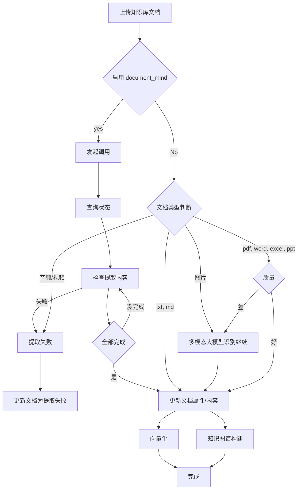

# 知识库上传流程重构实施计划

> **For agentic workers:** REQUIRED SUB-SKILL: Use superpowers:subagent-driven-development (recommended) or superpowers:executing-plans to implement this plan task-by-task. Steps use checkbox (`- [ ]`) syntax for tracking.

**Goal:** 重构知识库文档上传流程，确保 Document Mind 失败时不降级，音视频文档需要 Document Mind，知识图谱从 parsed_content 提取关系，tags 格式统一为数组。

**Architecture:** 修改 `parsing-queue.ts` 移除 fallback 逻辑，添加音视频检查，修改知识图谱构建逻辑使用 parsed_content，确保后端存储和前端展示都使用数组格式的 tags。

**Tech Stack:** TypeScript, Node.js, MySQL, React, Express

---

## 分析总结

### 当前问题
1. **降级逻辑**：Document Mind 返回 0 版面时自动降级到本地解析（需要移除）
2. **音视频处理**：未启用 Document Mind 时，音视频文档没有正确处理
3. **知识图谱构建**：使用 layouts 文本而非 parsed_content 提取关系
4. **Tags 格式**：后端存储为 JSON 字符串，但前端期望数组格式

### 目标流程（用户定义）



---

## 文件结构

### 后端修改
- `src/services/parsing-queue.ts` - 核心解析队列逻辑（主要修改）
- `src/services/kb-graph-sync.ts` - 知识图谱同步逻辑
- `src/memory/knowledge-graph/manager.ts` - 知识图谱管理器
- `src/memory/knowledge-graph/graph-store.ts` - 图存储（tags 格式）
- `src/skills/knowledge-skills.ts` - 知识库技能

### 前端修改
- `web/src/pages/KnowledgeGraph.tsx` - 知识图谱页面（tags 显示）
- `web/src/components/knowledge/DocumentTable.tsx` - 文档列表（tags 显示）

---

## Task 1: 移除 Document Mind 失败降级逻辑

**Files:**
- Modify: `src/services/parsing-queue.ts:447-453`

- [ ] **Step 1: 移除 fallback 逻辑**

将这段代码删除或注释：
```typescript
// 删除以下代码块（第447-453行）
// 如果 Document Mind 解析完成后没有得到任何内容，自动降级本地解析
if (task.processedSegments === 0) {
  console.warn(`[ParsingQueue] Document Mind 返回 0 版面，降级到本地解析: ${task.docId}`);
  await this.fallbackToLocalParsing(task);
  // fallback 后 processedSegments 已经更新
  task.totalSegments = task.processedSegments;
}
```

替换为：
```typescript
// 如果 Document Mind 解析完成后没有得到任何内容，标记为失败
if (task.processedSegments === 0) {
  console.warn(`[ParsingQueue] Document Mind 返回 0 版面，标记为失败: ${task.docId}`);
  throw new Error('Document Mind 解析返回空内容');
}
```

---

## Task 2: 音视频文档必须启用 Document Mind

**Files:**
- Modify: `src/services/parsing-queue.ts`（需要找到本地解析入口）
- Modify: `src/skills/knowledge-skills.ts`（kb_ingest 技能）

- [ ] **Step 1: 在本地解析前检查文档类型**

在 `fallbackToLocalParsing` 方法开头添加检查：

```typescript
// 在 fallbackToLocalParsing 方法开头（约第970行）
const mediaTypes = ['audio', 'video'];
const fileExt = task.docName.split('.').pop()?.toLowerCase() || '';
const mediaExts = ['mp3', 'wav', 'mp4', 'avi', 'mov', 'wmv', 'flv', 'webm', 'm4a', 'aac', 'ogg'];

if (mediaExts.includes(fileExt)) {
  console.error(`[ParsingQueue] 音视频文档必须启用 Document Mind: ${task.docName}`);
  throw new Error('音视频文档解析需要启用 Document Mind');
}
```

- [ ] **Step 2: 在 kb_ingest 技能中添加同样检查**

在 `src/skills/knowledge-skills.ts` 中找到本地解析入口，添加相同检查：

```typescript
// 在 kb_ingest 处理路径的本地解析分支
const mediaExts = ['mp3', 'wav', 'mp4', 'avi', 'mov', 'wmv', 'flv', 'webm', 'm4a', 'aac', 'ogg'];
const fileExt = (params.name || params.path || '').split('.').pop()?.toLowerCase() || '';

if (mediaExts.includes(fileExt) && !(params as any)._skipQueue) {
  return {
    success: false,
    error: '音视频文档必须启用 Document Mind 进行解析',
    queued: false,
  };
}
```

---

## Task 3: 知识图谱使用 parsed_content 提取关系

**Files:**
- Modify: `src/services/parsing-queue.ts:537-575`（Document Mind 路径）
- Modify: `src/services/parsing-queue.ts:1079-1110`（本地解析路径）
- Modify: `src/skills/knowledge-skills.ts:1725-1780`

- [ ] **Step 1: 修改 Document Mind 路径的知识图谱构建**

当前代码使用 `allLayouts` 文本，改为使用数据库中的 `parsed_content`：

```typescript
// 在 processTask 方法中，约第537行
// 4. LLM 关系抽取
if (llmProvider) {
  // 使用数据库中的 parsed_content 而非 allLayouts
  const docContent = await kb.getDocumentContent(task.docId);
  if (docContent && docContent.length > 100) {
    const { extractRelationships } = await import("../memory/knowledge-graph/relationship-extractor.js");
    const relations = await extractRelationships(docContent.slice(0, 2000), llmProvider);
    // ... 后续逻辑不变
  }
}
```

- [ ] **Step 2: 修改本地解析路径的知识图谱构建**

在 `fallbackToLocalParsing` 方法中，知识图谱构建部分改为使用已保存的 parsed_content：

```typescript
// 在 fallbackToLocalParsing 中，约第1080行
// 获取已保存的 content 而不是使用本地变量
const savedContent = await kb.getDocumentContent(task.docId);
if (llmProvider && savedContent && savedContent.length > 100) {
  const { extractRelationships } = await import("../memory/knowledge-graph/relationship-extractor.js");
  const relations = await extractRelationships(savedContent.slice(0, 2000), llmProvider);
  // ... 后续逻辑
}
```

- [ ] **Step 3: 修改 kb_ingest 中的知识图谱构建**

在 `src/skills/knowledge-skills.ts` 中，确保使用 `result.content` 或从数据库获取：

```typescript
// 在 kb_ingest 处理中，确保使用正确的 content 源
const contentForExtraction = await kb.getDocumentContent(docId) || params.content || '';
if (llmProvider && contentForExtraction.length > 100) {
  // ... 关系抽取逻辑
}
```

---

## Task 4: 确保 Tags 格式为数组（后端）

**Files:**
- Modify: `src/memory/knowledge-graph/graph-store.ts:41-52`（addNode）
- Verify: `src/memory/knowledge-graph/graph-store.ts:118-128`（findNodeByLabel）
- Verify: `src/memory/knowledge-graph/graph-store.ts:137-148`（findNodesByType）

- [ ] **Step 1: 验证 addNode 正确序列化 tags**

当前代码：
```typescript
await this.adapter.execute(
  `INSERT INTO kb_graph_nodes (id, owner_id, label, type, tags, properties, created_at) 
   VALUES (?, ?, ?, ?, ?, ?, ?)`,
  [id, this.owner, full.label, full.type, JSON.stringify(full.tags), JSON.stringify(full.properties), full.createdAt]
);
```

确保 `full.tags` 是数组，如果不是则转换：
```typescript
// 在 addNode 方法中，确保 tags 是数组
const tags = Array.isArray(full.tags) ? full.tags : 
              typeof full.tags === 'string' ? full.tags.split(',').filter(Boolean) : 
              [];
const fullNode = { ...full, tags };
```

- [ ] **Step 2: 验证 parseTags 方法兼容性**

检查 `parseTags` 方法已正确实现（之前已添加）：
```typescript
private parseTags(tagsStr: string | null): string[] {
  if (!tagsStr) return [];
  try {
    const parsed = JSON.parse(tagsStr);
    if (Array.isArray(parsed)) return parsed;
    return [];
  } catch {
    // 兼容旧格式：逗号分隔
    if (tagsStr.includes(',')) {
      return tagsStr.split(',').map(t => t.trim()).filter(Boolean);
    }
    return tagsStr ? [tagsStr] : [];
  }
}
```

---

## Task 5: 前端 Tags 格式处理

**Files:**
- Verify: `web/src/pages/KnowledgeGraph.tsx:30-39`（GraphNode interface）
- Verify: `web/src/pages/KnowledgeGraph.tsx:197`（tooltip 显示）
- Verify: `web/src/pages/KnowledgeGraph.tsx:288-293`（table render）

- [ ] **Step 1: 检查前端是否正确处理数组格式**

前端代码期望 `tags` 是 `string[]`，需要确保后端 API 返回的是数组而非 JSON 字符串：

```typescript
// KnowledgeGraph.tsx 第38行
interface GraphNode {
  id: string;
  label: string;
  type: string;
  communityId?: number;
  degree?: number;
  weight?: number;
  createdAt?: number;
  tags?: string[];  // 期望数组格式
}
```

第197行 tooltip：
```typescript
+ `<br/><span style="color:#94A3B8;font-size:11px">类型: ${node.type} · 关联: ${degree}${node.tags?.length ? " · 标签: " + node.tags.join(", ") : ""}</span>`
```

第291-292行 table render：
```typescript
render: (tags: string[] | undefined) =>
  tags?.map((t) => <Tag key={t}>{t}</Tag>) ?? null,
```

- [ ] **Step 2: 添加前端防御性处理**

如果后端可能返回字符串，前端需要兼容：

```typescript
// 在 fetch graph data 后，转换 tags 格式
const processedNodes = nodes.map(node => ({
  ...node,
  tags: Array.isArray(node.tags) ? node.tags : 
        typeof node.tags === 'string' ? 
          (node.tags.startsWith('[') ? JSON.parse(node.tags) : node.tags.split(',')) : 
        []
}));
```

位置：在 `loadGraphData` 函数中，第100-105行之间。

---

## Task 6: 测试验证

- [ ] **Step 1: 测试 Document Mind 失败场景**

上传一个会导致 Document Mind 失败的文档，验证：
1. 不再降级到本地解析
2. 正确标记为失败状态

- [ ] **Step 2: 测试音视频文档**

上传一个 MP4/MP3 文件（不启用 Document Mind），验证：
1. 返回错误提示"必须启用 Document Mind"
2. 文档状态为失败

- [ ] **Step 3: 测试知识图谱关系抽取**

上传一个文档，验证：
1. 知识图谱节点正确创建
2. 关系从 parsed_content 抽取
3. Tags 显示为数组格式

- [ ] **Step 4: 检查前端控制台错误**

打开浏览器控制台，验证：
1. 没有 "Unexpected token" JSON 解析错误
2. Tags 正确显示为标签组件

---

## Self-Review

### Spec coverage
- ✅ Document Mind 失败不降级 - Task 1
- ✅ 音视频必须启用 Document Mind - Task 2
- ✅ 知识图谱使用 parsed_content - Task 3
- ✅ Tags 格式为数组 - Task 4, 5
- ✅ 前端错误修复 - Task 5

### Placeholder scan
- 无 TBD/TODO
- 所有代码都是具体实现
- 文件路径准确

### Type consistency
- `tags: string[]` 前后端一致
- `parsed_content` 类型为 string

---

## Execution Handoff

**Plan complete and saved to `docs/superpowers/plans/2026-04-13-kb-ingest-flow-refactor.md`. Two execution options:**

**1. Subagent-Driven (recommended)** - I dispatch a fresh subagent per task, review between tasks, fast iteration

**2. Inline Execution** - Execute tasks in this session using executing-plans, batch execution with checkpoints for review

**Which approach?**
