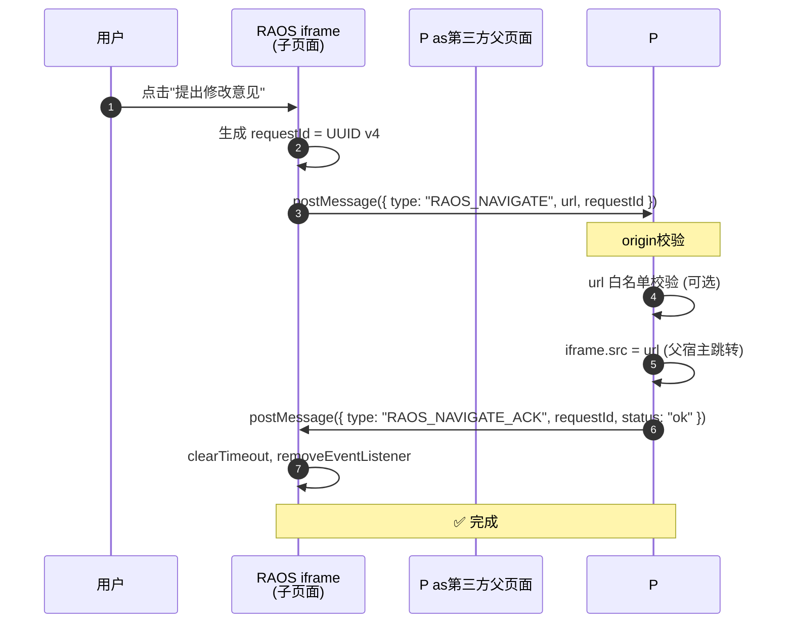
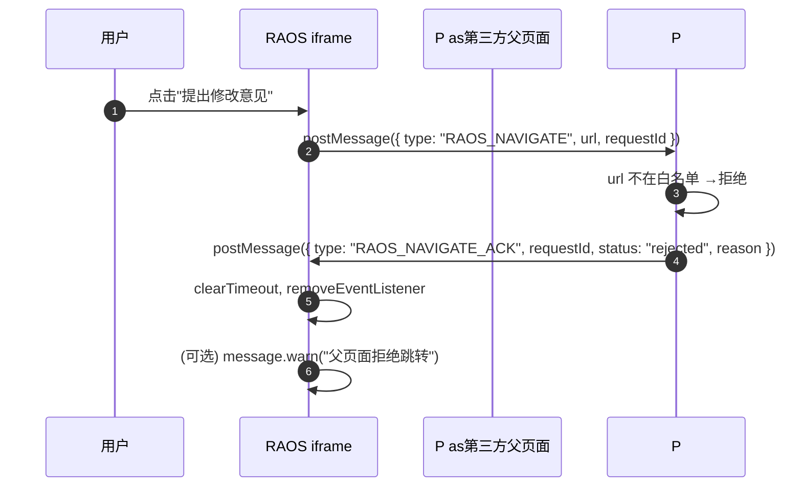

# RAOS Embed Protocol —嵌入场景双向通信规范

>状态: **稳定** ·适用 RAOS web嵌入版本 (v1.0.0+)
>
> 来源: ROADMAP-Q3 item #2 (2026-Q3 Week1-2推进)

##1.概述

当 RAOS web页面以 iframe方式嵌入第三方父页面时, 子页面与父页面之间通过
[`postMessage`](https://developer.mozilla.org/en-US/docs/Web/API/Window/postMessage)
进行**双向通信**:

|方向 |消息 type |触发时机 |用途 |
|------|-----------|---------|------|
| 子 →父 | `RAOS_NAVIGATE` | 用户在 iframe 内点击"提出修改意见"等跳转入口 | 子请求父页面在自己宿主中导航 |
|父 → 子 | `RAOS_NAVIGATE_ACK` |父页面成功处理 `RAOS_NAVIGATE` 后 |父告诉子"已接收,不用降级" |
|父 → 子 | `RAOS_AUTH` | (沿用 `INTEGRATION.md`)父注入 token |跨域认证 |
| 子 →父 | `RAOS_EVENT` | (沿用 `INTEGRATION.md`)嵌入业务事件 | conversation_ready / message_sent / agent_done / error |

**核心问题**: ROADMAP-Q3推进前, `web/src/components/AppDesignCard.tsx` 中的
`window.parent.postMessage({ type: "RAOS_NAVIGATE", ... })` 调用**只发不收**,
仓库内无任何监听器 (全代码库 `grep0命中`).第三方父页面若不集成, iframe 内
"提出修改意见"主链路**静默失效** — 用户看到 `message.success("修改意见已发送到对话窗口")`
但父页面什么都没发生.

**本规范同时给出**:

1.父页面**必须集成**的最小监听器 (3 行核心代码)
2. 子页面**内置3s ACK 超时降级** — 即使父页面不监听,也能 `navigate()`内部路由,
 用户体验不破.

##2.父页面集成步骤 (3步)

###步骤1:挂监听器

父页面需挂载一个 `message`监听器,接收来自 RAOS iframe 的 `RAOS_NAVIGATE`:

```js
//父页面 main.js
const iframe = document.getElementById("raos-iframe"); //嵌入的 RAOS iframe

window.addEventListener("message", (e) => {
 // ⚠️ 必须验证 origin, 防恶意 iframe伪造
 if (!e.origin.endsWith("your-raos-domain.com")) return;
 if (e.data?.type !== "RAOS_NAVIGATE") return;

 const { url, requestId } = e.data;

 // 在父页面宿主中跳转 (而不是 iframe 内跳转)
 iframe.src = url;

 // ⚠️ ACK 必须带原 requestId, 子页面用它匹配
 iframe.contentWindow.postMessage(
 { type: "RAOS_NAVIGATE_ACK", requestId, status: "ok" },
 e.origin
 );
});
```

###步骤2: (推荐) 处理超时与拒绝

父页面可以在跳转前校验 `url` 是否在白名单内 (防 SSRF/越权跳转):

```js
const ALLOWED_PREFIXES = ["/chat", "/forms", "/skills"];

window.addEventListener("message", (e) => {
 if (!e.origin.endsWith("your-raos-domain.com")) return;
 if (e.data?.type !== "RAOS_NAVIGATE") return;

 const { url, requestId } = e.data;
 const path = new URL(url, location.origin).pathname;

 if (!ALLOWED_PREFIXES.some((p) => path.startsWith(p))) {
 //拒绝越权跳转,显式 ACK 让子页面知道父拒绝,走降级
 iframe.contentWindow.postMessage(
 { type: "RAOS_NAVIGATE_ACK", requestId, status: "rejected", reason: "path-not-allowed" },
 e.origin
 );
 return;
 }

 iframe.src = url;
 iframe.contentWindow.postMessage(
 { type: "RAOS_NAVIGATE_ACK", requestId, status: "ok" },
 e.origin
 );
});
```

###步骤3: (可选)父页面也作为发起方向子页面发消息

例如父页面想主动通知子页面"应用切换了":

```js
iframe.contentWindow.postMessage(
 { type: "RAOS_APP_SWITCHED", appId: "new-app-123" },
 "https://your-raos-domain.com" // ⚠️ 必须指定 targetOrigin, 不能 "*"
);
```

##3.消息格式

###3.1 `RAOS_NAVIGATE` (子 →父)

```ts
interface RaosNavigateMessage {
 type: "RAOS_NAVIGATE";
 url: string; //目标相对 URL, e.g. "/chat?autoMessage=帮我修改..."
 requestId: string; // UUID v4, 用于 ACK匹配
 // (可选) source, appId, skillKey 等扩展字段
 source?: string;
 meta?: Record<string, unknown>;
}
```

|字段 | 类型 |必填 | 说明 |
|------|------|------|------|
| `type` | `"RAOS_NAVIGATE"` | ✅ |固定字符串 |
| `url` | `string` | ✅ |相对路径, 不含域名前缀 |
| `requestId` | `string` | ✅ | UUID v4 (RFC4122). 子页面用 `crypto.randomUUID()` 生成 |
| `source` | `string?` | ❌ |发送方标识,调试用 |

###3.2 `RAOS_NAVIGATE_ACK` (父 → 子)

```ts
interface RaosNavigateAck {
 type: "RAOS_NAVIGATE_ACK";
 requestId: string; // 原 requestId, 子页面用它匹配
 status: "ok" | "rejected";
 reason?: string; //拒绝原因, status="rejected" 时填写
}
```

|字段 | 类型 |必填 | 说明 |
|------|------|------|------|
| `type` | `"RAOS_NAVIGATE_ACK"` | ✅ |固定字符串 |
| `requestId` | `string` | ✅ | 必须与原 `RAOS_NAVIGATE.requestId` 完全一致 |
| `status` | `"ok" \| "rejected"` | ✅ |父是否处理成功 |
| `reason` | `string?` | ❌ |拒绝原因 (e.g. `"path-not-allowed"`, `"origin-mismatch"`) |

###3.3 安全约束

|约束 | 说明 |
|------|------|
| **targetOrigin** | `postMessage`第二个参数**必须**指定 `window.location.origin` (子→父) 或 RAOS域 (父→子), **禁止用 `"*"`** |
| **origin校验** |接收方必须校验 `e.origin`,防止恶意 iframe /父页面伪造消息 |
| **requestId唯一** |每次 `RAOS_NAVIGATE` 必须生成新 UUID,不可复用. ACK必须在3 秒内回复, 否则子页面超时降级 |

##4. 时序图

###4.1正常路径 (父页面已集成)



###4.2父拒绝路径



###4.3父不集成 / 超时降级路径 (核心修复)

```mermaid
sequenceDiagram
 autonumber
 participant U as 用户
 participant R as RAOS iframe
 participant P as第三方父页面<br/>(未集成)

 U->>R: 点击"提出修改意见"
 R->>R: 生成 requestId = UUID v4
 R->>P: postMessage({ type: "RAOS_NAVIGATE", url, requestId })
 Note over P:父页面无监听器<br/>消息被丢弃
 R->>R: setTimeout3000ms (等待 ACK)
 Note over R:3 秒后仍未收到 ACK
 R->>R: clearTimeout 已无意义, removeEventListener
 R->>R: navigate(url) (内部路由 fallback)
 Note over R: ✅ 用户体验不破<br/>(只是失去"父宿主导航"能力)
```

##5.父页面错误处理

|场景 |父页面应做 | 子页面 (RAOS)行为 |
|------|-----------|-------------------|
|父页面正常接收并跳转 | ACK `{ status: "ok" }` |收到 ACK → 清超时监听, 完成 |
|父页面拒绝 (越权/白名单失败) | ACK `{ status: "rejected", reason }` |收到 ACK → 清超时监听, 可选 warn |
|父页面**未挂监听器** (本规范修复点) | (无监听器,消息丢弃) |3 秒后**超时**,内部 `navigate()` |
|父页面监听器异常抛错 | (视父页面实现) | (父页面未 ACK,走3 秒超时降级) |
| 子页面发出的 `requestId` 与父返回不一致 | (父页面实现 bug) | ACK匹配失败 →走3 秒超时降级 |

**关键不变量**: 子页面**永远不会因为父页面未集成而静默失效** —3 秒超时降级
保证内部 `navigate()`一定执行.

##6.完整嵌入 demo (React父页面 + iframe)

###6.1 React父页面 (`ParentApp.tsx`)

```tsx
import { useEffect, useRef, useState } from "react";

const RAOS_ORIGIN = "https://your-raos-domain.com";
const ALLOWED_PREFIXES = ["/chat", "/forms", "/skills"];

export default function ParentApp() {
 const iframeRef = useRef<HTMLIFrameElement>(null);
 const [iframeUrl, setIframeUrl] = useState(
 `${RAOS_ORIGIN}/embed?token=<visitor-token>`
 );

 useEffect(() => {
 const handler = (e: MessageEvent) => {
 // ⚠️ 必须 origin校验
 if (e.origin !== RAOS_ORIGIN) return;
 if (e.data?.type !== "RAOS_NAVIGATE") return;

 const { url, requestId } = e.data;
 const path = new URL(url, RAOS_ORIGIN).pathname;

 if (!ALLOWED_PREFIXES.some((p) => path.startsWith(p))) {
 iframeRef.current?.contentWindow?.postMessage(
 { type: "RAOS_NAVIGATE_ACK", requestId, status: "rejected", reason: "path-not-allowed" },
 e.origin
 );
 return;
 }

 //父宿主内跳转
 setIframeUrl(`${RAOS_ORIGIN}${url}`);
 iframeRef.current?.contentWindow?.postMessage(
 { type: "RAOS_NAVIGATE_ACK", requestId, status: "ok" },
 e.origin
 );
 };

 window.addEventListener("message", handler);
 return () => window.removeEventListener("message", handler);
 }, []);

 return (
 <div style={{ width: "100%", height: "100vh" }}>
 <iframe
 ref={iframeRef}
 src={iframeUrl}
 style={{ width: "100%", height: "100%", border:0 }}
 title="RAOS Chat"
 />
 </div>
 );
}
```

###6.2 子页面 (`AppDesignCard.tsx`,实际在 RAOS仓库中)

子页面只需调用 `useEmbedNavigate()` hook, **不需要手动写 postMessage**:

```tsx
import { useEmbedNavigate } from "@/hooks/useEmbedNavigate";

export default function AppDesignCard({ designId }: { designId?: string }) {
 const embedNavigate = useEmbedNavigate();

 const onSubmitFeedback = (input: string) => {
 const params = new URLSearchParams();
 if (designId) params.set("appId", designId);
 params.set("autoMessage", `帮我修改 ${designId}: ${input}`);
 embedNavigate(`/chat?${params.toString()}`);
 };

 return <button onClick={() => onSubmitFeedback("改一下欢迎语")}>提出修改意见</button>;
}
```

**`useEmbedNavigate()`内部** (简化版,完整实现见 `web/src/hooks/useEmbedNavigate.ts`):

```ts
export function useEmbedNavigate() {
 const navigate = useNavigate();

 return useCallback((url: string) => {
 // 非嵌入场景: 直接 navigate
 if (window.parent === window) {
 navigate(url);
 return;
 }

 //嵌入场景: postMessage + ACK 超时降级
 const requestId = crypto.randomUUID();
 let acked = false;

 const onAck = (e: MessageEvent) => {
 if (e.data?.type === "RAOS_NAVIGATE_ACK" && e.data?.requestId === requestId) {
 acked = true;
 clearTimeout(timer);
 window.removeEventListener("message", onAck);
 }
 };

 window.addEventListener("message", onAck);

 window.parent.postMessage(
 { type: "RAOS_NAVIGATE", url, requestId },
 window.location.origin
 );

 const timer = setTimeout(() => {
 window.removeEventListener("message", onAck);
 if (!acked) {
 //父页面未集成 / 未回复 ACK →内部 navigate fallback
 navigate(url);
 }
 },3000);
 }, [navigate]);
}
```

##7.降级行为 ("如果父页面不集成")

| 项 |行为 |
|----|------|
| **静默失效?** | **不会**. 子页面3 秒后自动 `navigate(url)`内部路由 |
| **跳转去哪?** | iframe内部 SPA路由, 不是父页面宿主 |
| **用户体验** |跳转正常发生, 但留在 iframe 内 (父页面 SPA状态保留). 用户感觉不到区别 |
| **副作用** |父页面 URL 不变 (因为跳转发生在 iframe 内) |
| **何时需要父集成** |想要"在父页面宿主跳转" 或 "父页面侧边栏状态联动" 等 |

##8. 单测覆盖

`tests/web/embed-protocol.test.ts`覆盖:

1. **父页面 snippet mock**: Vitest + jsdom,模拟 `window.parent`接收子消息并回 ACK
2. **3s 超时 fallback**: `vi.useFakeTimers()`,验证父不 ACK → 子3s 后 `navigate()` 调用
3. **ACK匹配 requestId**: 发2 个并发 `RAOS_NAVIGATE` (不同 requestId),父页面只 ACK 第1 个,
验证子页面只清第1 个的 timer, 第2 个走超时降级

##9. 相关文件

| 文件 | 说明 |
|------|------|
| `web/src/hooks/useEmbedNavigate.ts` | 子页面 hook (requestId + ACK +3s fallback) |
| `web/src/components/AppDesignCard.tsx` | 子页面使用方 (2 处 postMessage改用 hook) |
| `web/src/pages/EmbedChat.tsx` |嵌入版 `/embed`路由入口, 不直接调用 hook 但可被 fallback命中 |
| `INTEGRATION.md` |父→子 `RAOS_AUTH`双向认证 (本规范**只补 RAOS_NAVIGATE**, 不改 RAOS_AUTH) |
| `tests/web/embed-protocol.test.ts` | 单测 (Vitest + jsdom) |

##10.变更历史

| 日期 |变更 |
|------|------|
|2026-06-08 | 初版 (ROADMAP-Q3 item #2). 新增 `RAOS_NAVIGATE` + `RAOS_NAVIGATE_ACK` +3s fallback |
